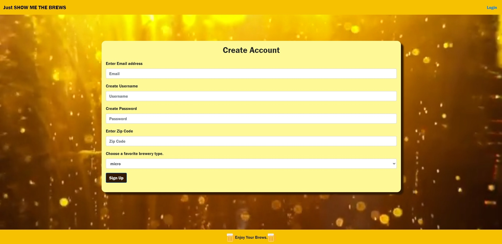

# Show Me The Brews

## Description:
This project is a Node server based Heroku app using Sequelize! We are using the Google Maps API, Zip Code API, and Brewery API to get data based on the User's requests. 
   
## Table of Contents:
* [User Story](#userstory)
* [Credits](#credits)
* [License](#license)
* [APIs](#apis)
* [Contributing](#contributing)
* [Questions](#questions)

## Front Signup Page

## User Story
AS a BEER LOVER
want to know about all of the craft breweries in my area (or in areas I plan to visit)
SO THAT I can enjoy beers everywhere I go

WHEN I visit the website / app
I am first asked for my name and zip code
THEN I am provided with an output of nearby breweries as well as the option to search under a different zip code

## License

Copyright (c) 2020 Jacob Ashworth

Permission is hereby granted, free of charge, to any person obtaining a copy
of this software and associated documentation files (the "Software"), to deal
in the Software without restriction, including without limitation the rights
to use, copy, modify, merge, publish, distribute, sublicense, and/or sell
copies of the Software, and to permit persons to whom the Software is
furnished to do so, subject to the following conditions:

The above copyright notice and this permission notice shall be included in all
copies or substantial portions of the Software.

THE SOFTWARE IS PROVIDED "AS IS", WITHOUT WARRANTY OF ANY KIND, EXPRESS OR
IMPLIED, INCLUDING BUT NOT LIMITED TO THE WARRANTIES OF MERCHANTABILITY,
FITNESS FOR A PARTICULAR PURPOSE AND NONINFRINGEMENT. IN NO EVENT SHALL THE
AUTHORS OR COPYRIGHT HOLDERS BE LIABLE FOR ANY CLAIM, DAMAGES OR OTHER
LIABILITY, WHETHER IN AN ACTION OF CONTRACT, TORT OR OTHERWISE, ARISING FROM,
OUT OF OR IN CONNECTION WITH THE SOFTWARE OR THE USE OR OTHER DEALINGS IN THE
SOFTWARE.

## APIs
* [Google Maps API](https://cloud.google.com/maps-platform/maps)
* [Zip Code API](http://api.zippopotam.us/)
* [Brewery API](https://www.openbrewerydb.org/)

## Contributing
* Jacob Ashworth
* Connor Cote
* Jacob Hoss

## Questions
Visit our Github pages for any questions! [Jacob Ashworth](https://github.com/jeashwor), [Connor Cote](https://github.com/cotec4), [Jacob Hoss](https://github.com/jacobhoss) 

## Visit the URL on Heroku to try it out!

[Heroku App](https://mighty-mesa-69962.herokuapp.com/)
